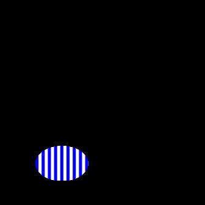
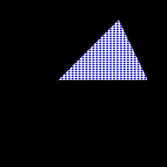
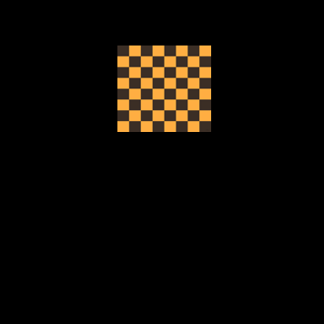
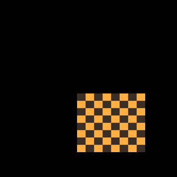
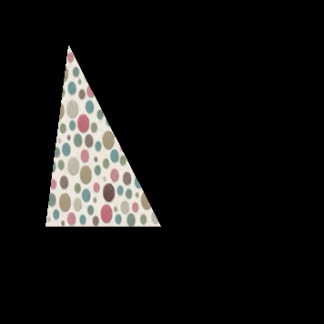
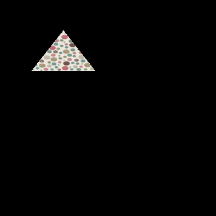

# Dataset Generation Utility

This repository provides utilities to generate image datasets for machine learning experiments. It allows you to fill geometric shape masks (circle, square, triangle) with different image classes or procedural patterns and export the resulting images in a structured format.  
The code supports popular datasets (CIFAR-10, MNIST), custom folders, and synthetic pattern backgrounds.

## Features

- **Mask Shapes:** Circle, square, triangle, with randomized scale and position.
- **Flexible Fillers:** Use images from CIFAR-10, MNIST, custom directories, or generated patterns (stripes, dots).
- **Pattern Generator:** Create stripe or dot backgrounds with customizable color and spacing.
- **Batch Generation:** Produce a specified number of samples per shape and class combination.
- **Padding:** Optional padding around the masked image.
- **Easy Integration:** Output images are saved to disk in a directory structure by shape.

## Example Output

Patterned packground example:
<div style="display: flex; gap: 16px;">
  
  
  
  
  
  
</div>


Custom background example:
<div style="display: flex; gap: 16px;">
  
  
  
  
  
  
</div>


## How It Works

1. **Select Backgrounds**
   - Generate background patterns or use custom image sets.
   - Images are grouped by shape class.

2. **Shape Mask Generation**
   - For each sample, a mask of the chosen shape is created, with randomized scale and position.

3. **Filling & Compositing**
   - An image is resized and pasted into the mask area.
   - The masked shape is combined with a black background or padding if needed.

4. **Saving**
   - The filled images are saved to disk, organized by shape type.


## Example Usage

Below you can find example usage of the code. More examples can be found in the [dataset_generation.ipynb](dataset_generation.ipynb) notebook
Additionally, the [evaluate_cnn.ipynb](evaluate_cnn.ipynb) notebook demonstrates how the dataset can be used in a simple experiment.

```python

pattern_settings = {
    'stripes_label': {'pattern_type': 'stripes', 'colors': ((0, 0, 255), (255, 255, 255)), 'stripe_width': 15},
    'dots_label': {'pattern_type': 'dots', 'colors': ((0, 0, 255), (255, 255, 255)), 'dot_radius': 3, 'spacing': 10},
    'horizontal_stripes_label': {'pattern_type': 'horizontal_stripes', 'colors': ((0, 0, 255), (255, 255, 255)), 'stripe_width': 15}
}


images_by_class = load_dataset('pattern', ['stripes_label', 'dots_label', 'horizontal_stripes_label'], 
                               max_images=100, image_size=256, pattern_settings=pattern_settings)

train_options = {
    'circle': ['stripes_label'], 
    'triangle': ['dots_label'],
    'square': ['horizontal_stripes_label']
}

test_options = {
    'circle': ['dots_label'], 
    'triangle': ['horizontal_stripes_label'],
    'square': ['stripes_label']
}

generate_dataset(images_by_class, train_options, output_dir='./dataset_pattern_base/train', size=256, padding=40, margin=16, num_samples=1000, shape_scale_range=(0.3, 1.0), position_jitter=0.5)
generate_dataset(images_by_class, train_options, output_dir='./dataset_pattern_base/test_matched_patterns', size=256, padding=40, margin=16, num_samples=200, shape_scale_range=(0.3, 1.0), position_jitter=0.5)
generate_dataset(images_by_class, test_options, output_dir='./dataset_pattern_base/test_swapped_patterns', size=256, padding=40, margin=16, num_samples=200, shape_scale_range=(0.3, 1.0), position_jitter=0.5)

```
